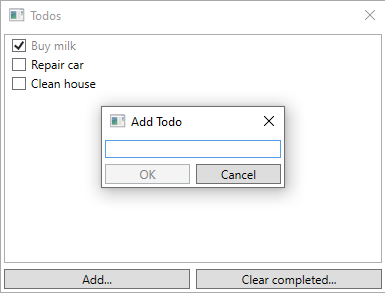

# MVVM Dialogs integrated into MVVM Light Toolkit

This repository contains code integrating [MVVM Dialogs](https://github.com/FantasticFiasco/mvvm-dialogs) into a sample application built using [MVVM Light Toolkit](http://www.mvvmlight.net/). As it normally is with software development, it is not the only way to accomplish the integration, most certainly not the optimal for you. But it's certainly a start.

Keep the things you like and replace the things you don't. Don't hesitate to open a new pull request if you have an opinion.

